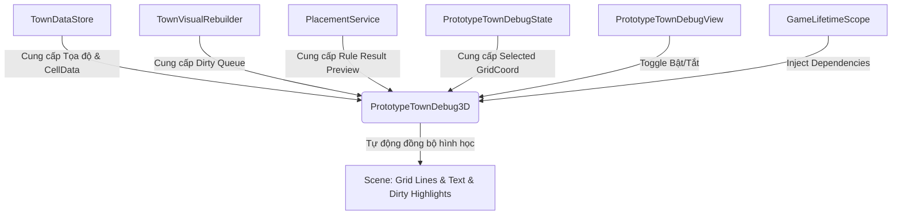

# Lớp Công Cụ Debug 3D Trực Quan (Visual Debug Tooling System)

Hệ thống **Visual Debug Tooling System** là một tập hợp các công cụ hỗ trợ trực quan hóa lưới đảo, thông tin quy tắc ô (Rules), và hàng đợi rebuild trực tiếp trên không gian 3D của Scene. Hệ thống được thiết kế để phục vụ việc kiểm thử nhanh, trực quan trên các thiết bị di động cũng như trên Unity Editor mà không ảnh hưởng đến hiệu năng của game.

---

## 1. Tổng Quan Kiến Trúc (Architecture Overview)

Hệ thống được phát triển theo mô hình **Data-First** và tách biệt hoàn toàn giữa dữ liệu mô phỏng và hiển thị hình học:



### Các Component Chính:
1. **`PrototypeTownDebug3D.cs`** (Core Driver):
   * Quản lý tạo Mesh vẽ lưới đảo duy nhất (`Grid Line Mesh`) thông qua 1 Draw Call.
   * Quản lý pooling các tấm phẳng `Dirty Box Marker` màu đỏ để highlight các ô đang chờ rebuild.
   * Cập nhật vị trí và nội dung của TextMesh 3D lơ lửng bám theo chiều cao thực tế của ô đang được chọn.
2. **`PrototypeTownDebugView.cs`** (IMGUI Panel):
   * Nhận tương tác bật/tắt từ người dùng qua 3 nút Toggle: *Grid Lines*, *Focus Info*, và *Dirty Box*.
   * Gửi lệnh trực tiếp sang `PrototypeTownDebug3D` để ẩn/hiện hoặc kích hoạt tính năng tương ứng.
3. **`TownGridView.cs`** (Data Adapter):
   * Cung cấp các thuộc tính `CellSpacing` (2.1f) và `BlockHeightStep` (0.35f) để hệ thống debug tính toán tọa độ không gian 3D chính xác tuyệt đối mà không cần hardcode.
4. **`GameLifetimeScope.cs`** (VContainer):
   * Thực hiện cơ chế Dependency Injection (DI) tự động để liên kết các Service dữ liệu với driver debug 3D.

---

## 2. Các Tính Năng & Cơ Chế Hoạt Động (Key Features)

### 2.1. Vẽ lưới Grid Line Mesh (1 Draw Call, 0 GC Alloc)
Thay vì sinh hàng trăm GameObject dạng đường thẳng riêng lẻ (gây sụt giảm hiệu năng nghiêm trọng do Draw Calls lớn), hệ thống tự động sinh một **Mesh Line duy nhất** chứa toàn bộ các đoạn thẳng biên giới của hòn đảo lúc bắt đầu game:
* **Hiệu năng**: Hiển thị qua đúng **1 MeshRenderer** duy nhất.
* **Tối ưu**: Khi bật/tắt lưới, chỉ tốn **0 GC Allocations** bằng cách gọi `gameObject.SetActive(true/false)` trên Object lưới line con, tránh việc dựng lại Mesh.
* **Chống Z-fighting**: Cao độ lưới được đặt cố định ở `Y = 0.02f` để nằm sát mặt đất nhưng không bị nhấp nháy chồng lấn hình học với Grid Terrain.

### 2.2. Focus-based 3D Floating UI (TextMesh)
Thay vì hiển thị thông tin hàng xóm và quy tắc (Rule) trên toàn bộ hàng trăm ô gây nhiễu loạn thị giác, hệ thống áp dụng cơ chế **chỉ hiển thị theo tiêu điểm (Focus-based)**:
* Khi bạn click chọn một ô, một TextMesh 3D sẽ xuất hiện lơ lửng phía trên ô đó.
* **Tự động bám chiều cao**: Vị trí Y của TextMesh tự động dịch chuyển lên trên block cao nhất của ô đó dựa trên công thức:
  $$\text{TargetY} = \text{Cell.Height} \times \text{BlockHeightStep} + \text{debugHeightOffset}$$
* **Nội dung hiển thị**: Tọa độ `X,Y`, độ cao `Height`, quy tắc áp dụng `VisualId` và hướng xoay `RotationId`.

### 2.3. Dirty Cell Highlight Pool (10 Box Markers)
Để kiểm thử quy trình rebuild bất đối xứng (chỉ cập nhật các ô bị bẩn và hàng xóm thay vì dựng lại cả đảo):
* Hệ thống khởi tạo sẵn một **Pool gồm 10 Box Marker phẳng mờ màu đỏ** không có Collider.
* Khi đặt hoặc xóa block nhanh, các ô bị bẩn đang nằm trong dirty queue chờ xử lý sẽ lập tức được highlight bằng các box mờ này.
* Khi luồng rebuild xử lý xong ô đó trong `LateUpdate`, box mờ sẽ tự động ẩn và quay về pool tái sử dụng, giúp nhà phát triển dễ dàng quan sát thứ tự và tốc độ rebuild.

---

## 3. Hướng Dẫn Sử Dụng (How to Use)

### 3.1. Thiết lập trong Unity Editor Scene
1. Mở Cảnh: `Assets/CozyBuilder/Scenes/KayKitFbxAssetTest.unity`.
2. Chọn GameObject **Town Grid View** trên Hierarchy.
3. Bấm **Add Component** trong Inspector và tìm kiếm: **`Prototype Town Debug 3D`**.
4. Cấu hình các thông số trong Inspector nếu muốn thay đổi giao diện:
   * `Grid Line Color` (Mặc định: Vàng ấm mờ - `#FFBA3373`).
   * `Dirty Highlight Color` (Mặc định: Đỏ mờ - `#FF333359`).
   * `Debug Height Offset` (Mặc định: `1.2f` - Khoảng cách chữ lơ lửng phía trên block).

> [!NOTE]
> Component này sẽ tự động được inject toàn bộ dependencies (như `TownGridView`, `PlacementService`, `TownVisualRebuilder`, v.v.) thông qua VContainer khi chạy game, bạn không cần phải kéo thả thủ công bất cứ service nào vào Inspector.

### 3.2. Sử dụng trên Giao diện Game (IMGUI Control)
* Khi nhấn **Play**, góc dưới bên trái màn hình sẽ xuất hiện bảng điều khiển **Town Debug**.
* Bên dưới bảng sẽ có cụm **3D Debug Tools** với 3 nút toggle:
  * **Grid Lines**: Bật/Tắt đường lưới vàng bao quanh đảo.
  * **Focus Info**: Bật/Tắt chữ 3D thông tin lơ lửng khi chọn ô.
  * **Dirty Box**: Bật/Tắt các tấm đỏ highlight ô bẩn chờ rebuild.

---

## 4. Hướng Dẫn Kiểm Thử (Verification & Testing Guide)

Để đảm bảo hệ thống hoạt động ổn định, chính xác và đạt chuẩn hiệu năng di động, hãy thực hiện quy trình kiểm thử gồm 2 phần dưới đây:

### 4.1. Kiểm thử trực quan (Visual Verification)

| Bước kiểm thử | Hành động thực hiện | Kết quả mong đợi (Đạt) |
| :--- | :--- | :--- |
| **1. Khởi chạy lưới** | Bấm Play trong Unity Editor. | Lưới đường thẳng màu vàng xuất hiện bao quanh đảo chính xác theo các ô vuông KayKit. Lưới phẳng không bị nhấp nháy hình học (Z-fighting). |
| **2. Kiểm tra Focus** | Dùng chuột click chọn một ô đất bất kỳ trên đảo. | Một TextMesh 3D xuất hiện lơ lửng trên ô được chọn. Chữ hướng về phía Camera, hiển thị đúng tọa độ và chiều cao của ô. |
| **3. Xây dựng chồng tầng** | Đặt liên tiếp 3 block lên cùng 1 ô. | Chữ Debug 3D tự động dịch chuyển tịnh tiến đi lên theo chiều cao của block mới xây, luôn duy trì khoảng cách lơ lửng ổn định (`1.2m` phía trên block cao nhất). |
| **4. Kiểm tra Rebuild Highlight** | Giới hạn Rebuild tốc độ chậm (hoặc đặt block nhanh liên tiếp). | Các tấm đỏ mờ xuất hiện chớp tắt tại ô vừa đặt và các ô hàng xóm lân cận bị ảnh hưởng, tự động biến mất ngay khi visual cập nhật xong. |
| **5. Kiểm tra Toggles** | Click bật/tắt các nút `Grid Lines`, `Focus Info`, `Dirty Box` trên panel. | Các thành phần hình học tương ứng biến mất/xuất hiện ngay lập tức trên Scene một cách mượt mà. |

### 4.2. Kiểm thử hiệu năng & Rác bộ nhớ (Performance & Memory Verification)

> [!IMPORTANT]
> **Quy tắc Vàng**: Mọi hoạt động cập nhật hình học, text, hay pool marker trong các hàm `LateUpdate()` tuyệt đối **không được phát sinh rác bộ nhớ (0 GC Allocations)**.

#### Cách đo GC Allocations bằng Unity Profiler:
1. Mở cửa sổ Profiler: **Window > Analysis > Profiler** (hoặc nhấn `Ctrl + 7`).
2. Chọn mục **CPU Usage** để ghi nhận dữ liệu hiệu năng.
3. Chuyển chế độ hiển thị bên dưới từ *Timeline* sang **Hierarchy**.
4. Sắp xếp danh sách theo cột **GC Alloc** giảm dần.
5. Thực hiện các thao tác:
   * Di chuyển xoay camera liên tục (Orbit/Pan/Zoom).
   * Hover chọn liên tục qua các ô khác nhau để chữ debug 3D nhảy liên tục.
   * Xây/Xóa block liên tục để kích hoạt highlight dirty.
   * Bật/Tắt các nút Toggle 3D Debug.
6. **Kết quả đạt chuẩn**: Hàm `PrototypeTownDebug3D.LateUpdate()` và các hàm con (`UpdateGridLineVisibility`, `UpdateFocusDebug`, `UpdateDirtyHighlights`) phải hiển thị **`0 B`** (Zero Bytes) hoàn hảo trong cột **GC Alloc**.

---

## 5. Danh Sách APIs & Tương Tác Code (Developer APIs)

Nếu bạn muốn điều khiển hệ thống Debug 3D thông qua các script khác (ví dụ: tắt toàn bộ debug khi chuyển giao diện chụp ảnh Cinematic):

```csharp
// Lấy component thông qua VContainer Injection
[Inject] private PrototypeTownDebug3D debug3D;

// Bật/tắt lưới line
debug3D.ToggleGrid(false);

// Bật/tắt chữ thông tin ô
debug3D.ToggleFocusDebug(false);

// Bật/tắt highlight ô bẩn
debug3D.ToggleDirtyHighlight(false);

// Truy vấn trạng thái hiện tại
bool isGridOn = debug3D.IsGridActive;
```
