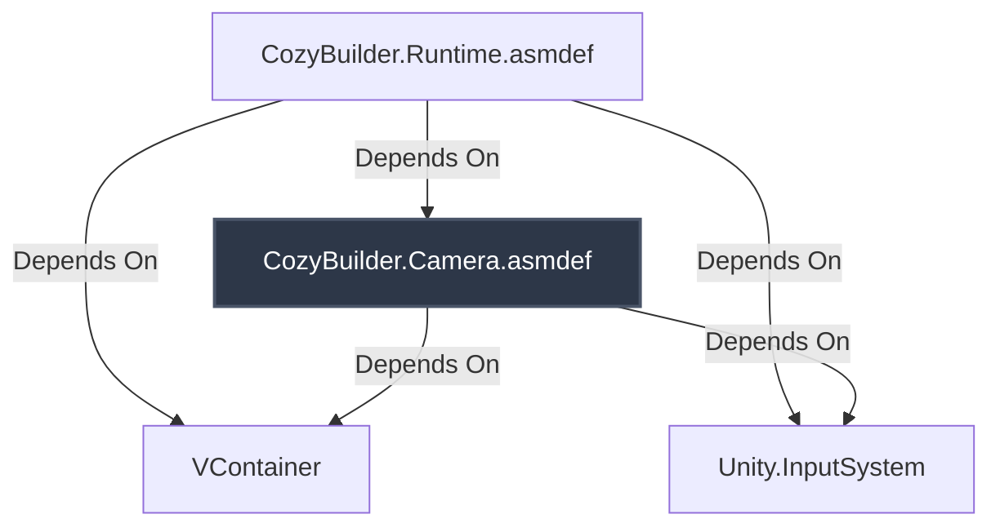

# Tài liệu Thiết Kế - Module Hóa và Tách Biệt Hệ Thống Camera (Camera Decoupling Design)

> [!NOTE]
> Tài liệu này mô tả thiết kế và kiến trúc tách biệt hệ thống Camera thành một module/assembly độc lập nhằm tuân thủ nguyên lý Dependency Inversion, cải thiện khả năng bảo trì, và giảm thiểu tối đa các mối liên kết chặt chẽ (tight coupling) giữa camera và gameplay/UI.

---

## 1. Kiến Trúc và Tổ Chức Assembly

Hệ thống Camera sẽ được đưa vào một **Assembly Definition** riêng biệt nhằm cách ly hoàn toàn mã nguồn của nó khỏi phần còn lại của game. Điều này đảm bảo rằng các tính năng gameplay cốt lõi hoặc giao diện người dùng không thể can thiệp trực tiếp vào camera và ngược lại.



### Chi tiết các Assembly:
1. **`CozyBuilder.Camera.asmdef` [NEW]**:
   - Định nghĩa Assembly riêng tại `Assets/CozyBuilder/Runtime/Camera/`.
   - Tham chiếu tới: `VContainer` và `Unity.InputSystem`.
   - **Không tham chiếu ngược** tới `CozyBuilder.Runtime`.
2. **`CozyBuilder.Runtime.asmdef` [MODIFY]**:
   - Cập nhật để bổ sung tham chiếu tới `CozyBuilder.Camera`.

---

## 2. Thiết Kế API & Giải Quyết Liên Kết Chặt (Decoupling)

Hiện tại, `PrototypeCameraInputDriver.cs` đang phụ thuộc trực tiếp vào các UI cụ thể (`PrototypePlacementControlsView` và `PrototypeTownDebugView`) để kiểm tra vùng chặn tương tác (`IsPointerOverUI`).

Để tách biệt, chúng ta áp dụng **Dependency Inversion Principle (DIP)** thông qua một Interface mới:

### Interface `ICameraInputBlocker` [NEW]
Được khai báo trong Assembly `CozyBuilder.Camera` dưới namespace `CozyBuilder.Camera`:

```csharp
using UnityEngine;

namespace CozyBuilder.Camera
{
    public interface ICameraInputBlocker
    {
        bool IsPointerOverUI(Vector2 screenPosition);
    }
}
```

### Cấu trúc mới của `PrototypeCameraInputDriver` [MODIFY]
Thay vì lưu trữ các thuộc tính View cụ thể, lớp driver sẽ nhận danh sách các blocker thông qua Dependency Injection:

```csharp
namespace CozyBuilder.Camera
{
    public sealed class PrototypeCameraInputDriver : MonoBehaviour
    {
        private CameraService cameraService;
        private IReadOnlyList<ICameraInputBlocker> inputBlockers;

        [Inject]
        public void Construct(
            CameraService cameraService,
            IReadOnlyList<ICameraInputBlocker> inputBlockers = null)
        {
            this.cameraService = cameraService;
            this.inputBlockers = inputBlockers;
        }

        private bool IsPointerOverUI(Vector2 screenPosition)
        {
            // 1. Kiểm tra EventSystem chung (UGUI/UI Toolkit)
            if (EventSystem.current != null && EventSystem.current.IsPointerOverGameObject())
            {
                return true;
            }

            // 2. Duyệt qua các blocker động được inject mà không tạo bộ nhớ rác (Zero GC Allocation)
            if (inputBlockers != null)
            {
                int count = inputBlockers.Count;
                for (int i = 0; i < count; i++)
                {
                    if (inputBlockers[i].IsPointerOverUI(screenPosition))
                    {
                        return true;
                    }
                }
            }

            return false;
        }
    }
}
```

---

## 3. Liên Kết Phụ Thuộc Trong VContainer (Dependency Injection)

Lớp `GameLifetimeScope.cs` (nằm ở `CozyBuilder.Runtime`) sẽ là nơi kết nối hai Assembly lại với nhau thông qua cơ chế đăng ký interface:

```csharp
// Đăng ký các View giao diện vừa là chính nó vừa đóng vai trò chặn tương tác camera
builder.RegisterComponentInHierarchy<PrototypePlacementControlsView>()
    .AsSelf()
    .As<ICameraInputBlocker>();

builder.RegisterComponentInHierarchy<PrototypeTownDebugView>()
    .AsSelf()
    .As<ICameraInputBlocker>();
```

VContainer sẽ tự động thu gom mọi thành phần được đăng ký dưới dạng `ICameraInputBlocker` trong Scene để đưa vào danh sách `IReadOnlyList<ICameraInputBlocker>` tiêm cho Camera.

---

## 4. Kế hoạch xác minh (Verification Plan)

### Kiểm thử biên dịch (Automated Compilation Check)
- Đảm bảo dự án Unity biên dịch thành công mà không có lỗi tham chiếu vòng (circular dependency) hoặc thiếu tham chiếu.
- Chạy `graphify update .` để đồng bộ lại đồ thị AST.

### Kiểm thử thủ công (Manual Verification in Play Mode)
1. Chạy game ở chế độ Play Mode.
2. Kiểm tra xem thao tác bấm chuột trên bảng Debug Panel và Placement Controls Panel có bị chặn tương tác xoay/pan/zoom camera hay không.
3. Kiểm tra xem camera có xoay/pan/zoom bình thường khi tương tác ngoài UI hay không.
