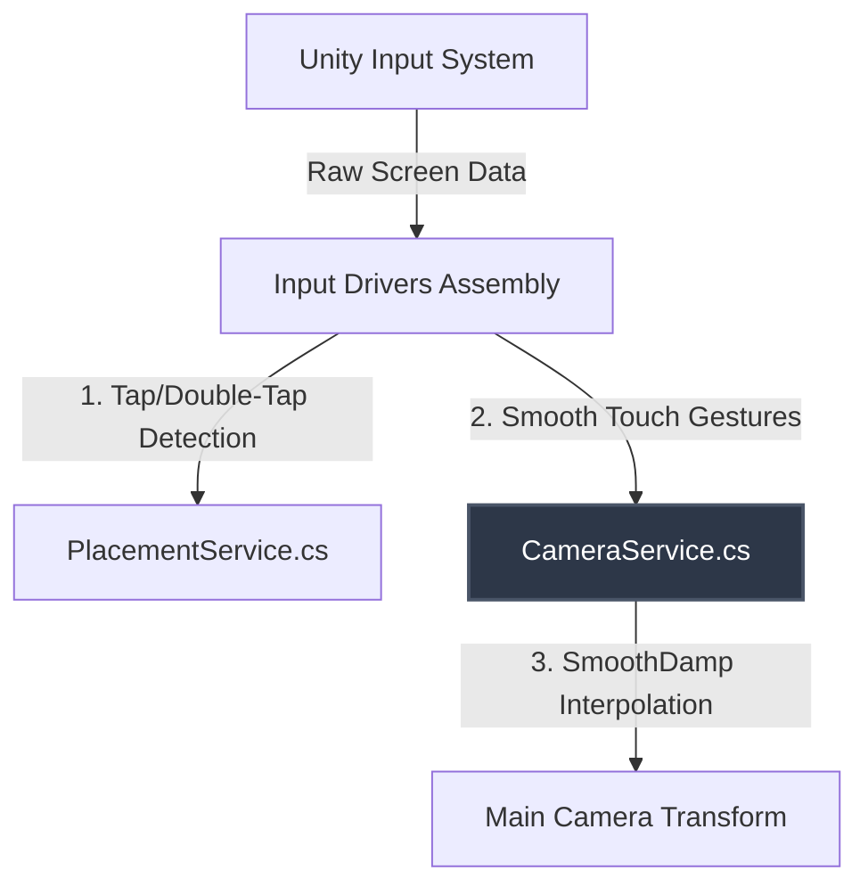
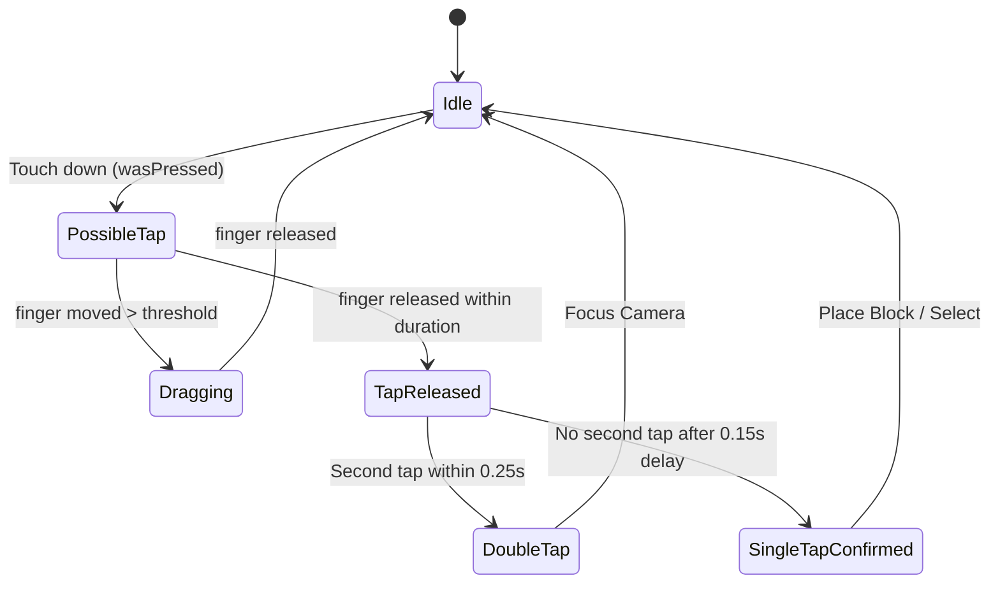

# Tài liệu Thiết Kế - Hệ Thống Tương Tác Camera Cao Cấp & Cử Chỉ Di Động (Premium Camera Interactions & Touch Gestures)

> [!NOTE]
> Tài liệu này mô tả thiết kế kỹ thuật chi tiết nhằm nâng cấp hệ thống Camera và xử lý Input của dự án Cozy Builder lên tiêu chuẩn Premium. 
> Mục tiêu chính là mang lại cảm giác tương tác mượt mà (cozy feel) thông qua quán tính (damping), hỗ trợ đầy đủ cử chỉ di động đa chạm, phân biệt hoàn hảo giữa nhấp đặt block (Tap) và xoay camera (Drag), giới hạn biên an toàn cho camera, và tính năng nhấp đúp lấy nét (Double-Tap to Focus). Tất cả đều được thiết kế tối ưu hóa hiệu suất với bộ nhớ rác bằng 0 (Zero GC Allocation).

---

## 1. Tổng Quan Kiến Trúc Tương Tác

Hệ thống điều khiển camera sẽ được nâng cấp nhưng vẫn duy trì cấu trúc tách biệt tuyệt đối (Decoupled Architecture) đã được thiết lập trước đó.



* **`PrototypePlacementInputDriver.cs`**: Quản lý bộ lọc trạng thái cảm ứng để phát hiện chính xác cú chạm (Tap) hoặc nhấp đúp (Double-Tap), đồng thời chặn hoàn toàn tương tác đặt block khi người chơi đang kéo xoay camera.
* **`PrototypeCameraInputDriver.cs`**: Tiếp nhận dữ liệu cử chỉ 1 ngón hoặc 2 ngón (Zoom/Pan), gửi các lệnh thay đổi mục tiêu (Target) sang `CameraService`.
* **`CameraService.cs`**: Quản lý trạng thái camera thực tế và mục tiêu, thực hiện nội suy làm mượt (`SmoothDamp`) và giới hạn biên (`Boundaries`).

---

## 2. Phần 1: Cơ Chế Phân Biệt Tap, Double-Tap và Drag (Không GC)

Để ngăn việc đặt nhầm block khi xoay camera, và hỗ trợ nhấp đúp để lấy nét, chúng ta thiết kế một máy trạng thái cảm ứng (Touch State Machine) gọn nhẹ trong `PrototypePlacementInputDriver.cs`.



### Thuật toán lọc Tap / Double-Tap:
1. **Khi ngón tay chạm xuống (`touchscreen.primaryTouch.press.wasPressedThisFrame`)**:
   - Ghi lại `touchStartPos = position.ReadValue();`
   - Ghi lại `touchStartTime = Time.time;`
   - Thiết lập `isPossibleTap = true;`
2. **Trong lúc giữ ngón tay**:
   - Nếu `isPossibleTap == true` và `Vector2.Distance(currentPos, touchStartPos) > 15f` (Vượt ngưỡng dịch chuyển pixel):
     - Thiết lập `isPossibleTap = false;` (Chuyển sang cử chỉ Drag xoay camera).
3. **Khi ngón tay nhấc lên (`touchscreen.primaryTouch.press.wasReleasedThisFrame`)**:
   - Nếu `isPossibleTap == true` và `(Time.time - touchStartTime) <= 0.25s`:
     - Kiểm tra nếu đây là cú nhấn thứ hai trong khoảng thời gian `0.25s` kể từ cú chạm trước:
       - Hủy lệnh đặt block của cú chạm trước.
       - Kích hoạt sự kiện **Double-Tap (Focus Camera)** tại vị trí mục tiêu dưới con trỏ.
     - Nếu không, thiết lập một bộ đệm trễ `0.15s` (sử dụng một biến thời gian đơn giản trong `Update` để tránh GC Allocations của Coroutines/UniTask):
       - Sau `0.15s`, nếu không có chạm mới, xác nhận cú chạm là **Single-Tap (Place Block)**.

---

## 3. Phần 2: Cơ Chế Cử Chỉ Mobile Đa Chạm (Zero-GC)

Hệ thống cử chỉ di động trong `PrototypeCameraInputDriver.cs` sẽ hỗ trợ đầy đủ các thao tác đa điểm mà không tạo đối tượng mới trong Update Loop:

```csharp
// Thuật toán tách cử chỉ đa điểm tối ưu trong LateUpdate():
var touchscreen = Touchscreen.current;
if (touchscreen == null) return;

var firstTouch = touchscreen.touches[0];
var secondTouch = touchscreen.touches[1];

bool firstActive = firstTouch.press.isPressed;
bool secondActive = secondTouch.press.isPressed;

if (firstActive && !secondActive)
{
    // 1 Ngón tay chạm: Xoay Camera (Orbit)
    // Chỉ kích hoạt Orbit nếu lượt chạm này không bắt đầu từ UI và không phải là Tap
    if (!wasDragStartedOverUI && !isPlacementTapActive)
    {
        var delta = firstTouch.delta.ReadValue();
        cameraService.AddOrbitTarget(delta.x * orbitSensitivity, -delta.y * orbitSensitivity);
    }
}
else if (firstActive && secondActive)
{
    // 2 Ngón tay chạm: Zoom (Pinch) kết hợp Pan (Kéo di chuyển tâm)
    if (!wasTouchStartedOverUI)
    {
        Vector2 pos1 = firstTouch.position.ReadValue();
        Vector2 pos2 = secondTouch.position.ReadValue();
        Vector2 delta1 = firstTouch.delta.ReadValue();
        Vector2 delta2 = secondTouch.delta.ReadValue();
        
        // 1. Tính toán Pan delta (Trung bình chuyển dịch của 2 ngón)
        Vector2 panDelta = (delta1 + delta2) * 0.5f;
        cameraService.AddPanTarget(panDelta, GetPanUnitsPerPixel());
        
        // 2. Tính toán Zoom pinch delta
        Vector2 prevPos1 = pos1 - delta1;
        Vector2 prevPos2 = pos2 - delta2;
        float currentDistance = Vector2.Distance(pos1, pos2);
        float prevDistance = Vector2.Distance(prevPos1, prevPos2);
        float zoomDelta = (currentDistance - prevDistance) * touchPinchSensitivity;
        
        cameraService.AddZoomTarget(-zoomDelta);
    }
}
```

---

## 4. Phần 3: Nội Suy Làm Mượt & Quán Tính (Smooth Damping)

Để tạo ra chuyển động camera lướt êm ái thư giãn, `CameraService.cs` sẽ quản lý cả hai trạng thái: giá trị mục tiêu (**Target**) và giá trị hiện tại (**Current**). Các thay đổi đầu vào sẽ cộng dồn vào Target, và hệ thống sẽ liên tục trượt Current về phía Target trong mỗi khung hình.

### Các tham số cấu trúc trong `CameraService.cs`:
```csharp
public sealed class CameraService
{
    // Trạng thái hiện tại thực tế trên Scene
    private Vector3 currentPivot;
    private float currentDistance;
    private float currentYaw;
    private float currentPitch;
    
    // Trạng thái mục tiêu mà người chơi hướng tới
    private Vector3 targetPivot;
    private float targetDistance;
    private float targetYaw;
    private float targetPitch;

    // Vận tốc nội suy SmoothDamp (Bắt buộc lưu trữ để SmoothDamp hoạt động ổn định)
    private Vector3 pivotVelocity;
    private float distanceVelocity;
    private float yawVelocity;
    private float pitchVelocity;

    [Header("Damping Times")]
    private float pivotSmoothTime = 0.15f;
    private float orbitSmoothTime = 0.12f;
    private float zoomSmoothTime = 0.18f;
    
    // Thuật toán làm mượt trong ApplyTo():
    public void ApplyTo(Transform cameraTransform)
    {
        // Nội suy mượt mà từng thành phần
        currentPivot = Vector3.SmoothDamp(currentPivot, targetPivot, ref pivotVelocity, pivotSmoothTime);
        currentDistance = Mathf.SmoothDamp(currentDistance, targetDistance, ref distanceVelocity, zoomSmoothTime);
        currentYaw = Mathf.SmoothDampAngle(currentYaw, targetYaw, ref yawVelocity, orbitSmoothTime);
        currentPitch = Mathf.SmoothDamp(currentPitch, targetPitch, ref pitchVelocity, orbitSmoothTime);

        // Áp dụng phép toán quay và thiết lập tọa độ camera
        var rotation = Quaternion.Euler(currentPitch, currentYaw, 0f);
        cameraTransform.SetPositionAndRotation(currentPivot + rotation * new Vector3(0f, 0f, -currentDistance), rotation);
    }
}
```

---

## 5. Phần 4: Giới Hạn Biên An Toàn (Camera Boundaries)

Để tránh việc người chơi vô tình "kéo" camera bay xa vĩnh viễn khỏi thị trấn nhỏ xinh đẹp, chúng ta giới hạn tâm Pivot của camera trong một vòng tròn/hình vuông an toàn bao quanh hòn đảo.

* **Tham số mới**:
  ```csharp
  private float maxPivotRadius = 15f; // Bán kính tối đa được phép Pan rời xa tâm (0,0,0)
  ```
* **Cơ chế giới hạn**:
  Trong hàm `AddPanTarget(Vector2 delta)`, sau khi dịch chuyển `targetPivot`, chúng ta sẽ giới hạn khoảng cách so với gốc tọa độ:
  ```csharp
  Vector3 tempPivot = targetPivot - (right * delta.x + forward * delta.y) * unitsPerPixel;
  if (tempPivot.magnitude > maxPivotRadius)
  {
      tempPivot = tempPivot.normalized * maxPivotRadius;
  }
  targetPivot = tempPivot;
  ```

---

## 6. Kế Hoạch Xác Minh (Verification Plan)

### Kiểm thử biên dịch (Automated Compilation Check)
- Biên dịch dự án trong Unity Editor, đảm bảo không có bất kỳ cảnh báo hoặc lỗi C# nào liên quan đến các thay đổi hình học hoặc Input System.
- Chạy `graphify update .` sau khi thay đổi mã nguồn để đảm bảo đồ thị AST luôn mới nhất.

### Kiểm thử hiệu năng (GC Performance Verification)
- Mở cửa sổ **Profiler** trong Unity.
- Chạy thử nghiệm Play Mode, thực hiện thao tác kéo xoay liên tục bằng chuột/cảm ứng giả lập và zoom chuột liên tục.
- Xác nhận chỉ số **GC Alloc** của `PrototypeCameraInputDriver` và `PrototypePlacementInputDriver` trong Update loop bằng đúng **0 bytes**.

### Kiểm thử tính năng thủ công (Manual Verification in Play Mode)
1. **Kiểm thử Tap vs Drag**: Kéo xoay camera liên tục khắp màn hình di động/chuột. Đảm bảo **không có bất kỳ Block nào bị đặt nhầm** trong quá trình kéo xoay.
2. **Kiểm thử Tap đơn**: Bấm nhẹ một điểm, đảm bảo block được đặt chính xác ngay khi nhấc tay lên.
3. **Kiểm thử Nhấp đúp (Double-Tap Focus)**: Nhấp đúp vào một ô đất trống hoặc block ở xa. Đảm bảo camera trượt tâm Pivot mượt mà và lấy nét trực diện vào ô đó.
4. **Kiểm thử Quán tính (Inertia/Damping)**: Thực hiện động tác cuộn chuột zoom nhanh hoặc vuốt chuột xoay nhanh, kiểm tra xem camera có lướt đi êm ái và giảm tốc độ từ từ hay không.
5. **Kiểm thử Biên giới hạn (Boundaries)**: Kéo di chuyển (Pan) camera ra xa hết cỡ. Xác nhận camera bị chặn lại ở rìa hòn đảo và không thể pan đi tiếp được nữa.
